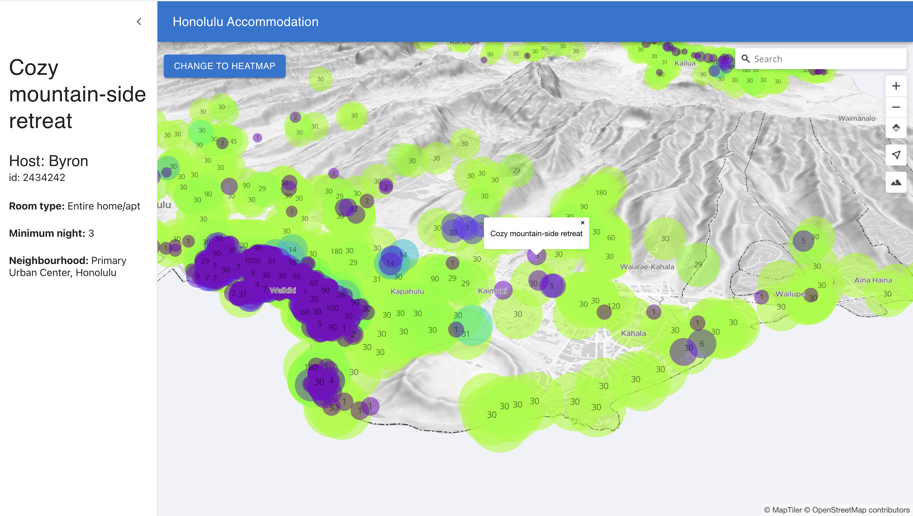

# Maps in React

The main branch's code shows a basic example of a map with a marker and navbar using React and MapTiler SDK. (MapTiler SDK extends MapLibre GL JS with functions related to the MapTiler mapping platform. The basic concepts of this tutorial also show how to create a React map with MapLibre GL JS). You can find a step-by-step tutorial for it [here](https://docs.maptiler.com/react/sdk-js/get-started-material-ui/?utm_medium=social&utm_source=github&utm_campaign=2024%20|%20react).

Repository branches show code changes corresponding to the [MapTiler React video series](https://youtube.com/playlist?list=PLGHe6Moaz52Mb9_0qH9mdktsTgkrow9oI&si=2RCT0UU_2ssLyGjN).


---

📖 [Documentation](https://docs.maptiler.com/react/sdk-js/get-started-material-ui/) &nbsp; 📦 🔑 [Get API Key](https://cloud.maptiler.com/account/keys/)

---

<br>

<details> <summary><b>Table of Contents</b></summary>
<ul>
<li><a href="#-basic-usage">Basic Usage</a></li>
<li><a href="#-related-examples">Examples</a></li>
<li><a href="#maps-in-react-series">Maps in React series</a></li>
<li><a href="#-support">Support</a></li>
<li><a href="#-contributing">Contributing</a></li>
<li><a href="#-license">License</a></li>
<li><a href="#-acknowledgements">Acknowledgements</a></li>
</ul>
</details>

<p align="center">     <br />  <a href="https://docs.maptiler.com/react/sdk-js/get-started-material-ui/">See live interactive demo</a> </p>
<br>

## 🚀 Basic Usage

1. Clone this repo

```shell
  git clone https://github.com/maptiler/maps-in-react.git my-react-map
```

2. Navigate to the newly created project folder **my-react-map**

```shell
  cd my-react-map
```

3. Install dependencies

```shell
  npm install
```

4. :warning: Open my-react-map/src/config.js and replace **YOUR_MAPTILER_API_KEY_HERE** with your actual [MapTiler API key](https://cloud.maptiler.com/account/keys/).
   If you don't have an API KEY, you can create it for **FREE** at https://www.maptiler.com/cloud/

5. Start your local environment

```shell
  npm run dev
```

6. You will find your app on the address http://localhost:5173/.
   Now, you should see the map in your browser.

<br>

## 💡 Related Examples

- [Episode 0: Map in React JS with Material UI](https://docs.maptiler.com/react/sdk-js/get-started-material-ui/)
- [Episode 1: Map in React JS point data from geojson data](https://docs.maptiler.com/react/sdk-js/geojson-points/)
- [Episode 2: Map in React JS create a heatmap](https://docs.maptiler.com/react/sdk-js/heatmap/)
- [Episode 3: Map in React js with popup and sidebar](https://docs.maptiler.com/react/sdk-js/popup-sidebar/)
- [Episode 4: Map in React js with geocoding control](https://docs.maptiler.com/react/sdk-js/geocoding-control/)
- [Episode 5: 3D Map in React js with geocoding control](https://docs.maptiler.com/react/sdk-js/3d-map/)

Check out the full list of [MapTiler examples](https://docs.maptiler.com/react/examples/)

<br>

## Maps in React series

### Episode specific instructions

Here is the step-by-step guide for creating a state in the main branch: https://docs.maptiler.com/react/sdk-js/get-started-material-ui/. 

#### E1 - Map in React js with geojson data, points, and clusters

[step-by-step tutorial](https://docs.maptiler.com/react/sdk-js/geojson-points/?utm_medium=social&utm_source=github&utm_campaign=2024%20|%20react)

add custom geojson data to a React map with SDK helpers
read more about **[MapTilerSDK point helper](https://docs.maptiler.com/sdk-js/api/helpers/#point?utm_medium=social&utm_source=github&utm_campaign=2024%20|%20react)**

You can find GeoJSON data used in tutorial videos in the assets folder.

#### E2 - Map in React js with heatmap and visualization switcher

[step-by-step tutorial](https://docs.maptiler.com/react/sdk-js/heatmap/?utm_medium=social&utm_source=github&utm_campaign=2024%20|%20react)

**[MapTiler SDK heatmap helper](https://docs.maptiler.com/sdk-js/api/helpers/#heatmap?utm_medium=social&utm_source=github&utm_campaign=2024%20|%20react)** 
**[MapTiler SDK Color Ramp](https://docs.maptiler.com/sdk-js/api/color-ramp/?utm_medium=social&utm_source=github&utm_campaign=2024%20|%20react)**

#### E3 - Map in React js with popup and sidebar

[step-by-step tutorial](https://docs.maptiler.com/react/sdk-js/popup-sidebar/?utm_medium=social&utm_source=github&utm_campaign=2024%20|%20react)

**Material UI:** https://mui.com/core/
**MUI sidebar examples:** https://mui.com/material-ui/react-drawer/

#### E4 - Map in React js with geocoding control

[step-by-step tutorial](https://docs.maptiler.com/react/sdk-js/geocoding-control/?utm_medium=social&utm_source=github&utm_campaign=2024%20|%20react)

Download MapTiler geocoding control from npm: https://www.npmjs.com/package/@maptiler/geocoding-control

Open the terminal on the my-react-map folder.

- npm i @maptiler/geocoding-control
- npm install
- npm run dev //to start your map app
  [geocoding API reference](https://docs.maptiler.com/client-js/geocoding/?utm_medium=social&utm_source=github&utm_campaign=2024%20|%20react) 

#### E5 - 3D Map in React js

[step-by-step tutorial](https://docs.maptiler.com/react/sdk-js/3d-map/?utm_medium=social&utm_source=github&utm_campaign=2024%20|%20react)

Enable/disable map terrain programmatically: [https://docs.maptiler.com/sdk-js/examples/map-terrain/](https://docs.maptiler.com/sdk-js/examples/map-terrain/?utm_medium=social&utm_source=github&utm_campaign=2024%20|%20react)

How to find the id of last text map layer?


1. Go to [MapTiler](https://cloud.maptiler.com/?utm_medium=social&utm_source=github&utm_campaign=2024%20|%20react)
2. Select a map that you want to use as a basemap
3. Customize
4. Go to layer - Verticality and find the last symbol layer
5. Click at the last symbol layer and open JSON editor ( {} )
6. Copy layer id, e.g., "Ocean labels".

Check out the [How to make custom map design in MapTiler](https://docs.maptiler.com/guides/map-design/how-to-make-custom-map-design-in-maptiler-cloud/) tutorial

<br>

## 💬 Support

- 📚 [Documentation](https://docs.maptiler.com/react/sdk-js/get-started-material-ui/) - Comprehensive guides and API reference
- ✉️ [Contact us](https://maptiler.com/contact) - Get in touch or submit a request
- 🐦 [Twitter/X](https://twitter.com/maptiler) - Follow us for updates

<br>

---

<br>

## 🤝 Contributing

We love contributions from the community! Whether it's bug reports, feature requests, or pull requests, all contributions are welcome:

- Fork the repository and create your branch from `main`
- If you've added code, add tests that cover your changes
- Ensure your code follows our style guidelines
- Give your pull request a clear, descriptive summary
- Open a Pull Request with a comprehensive description

<br>

## 📄 License

This project is licensed under the MIT License – see the [LICENSE](./LICENSE) file for details.

<br>

## 🙏 Acknowledgements

This project is built on the shoulders of giants:

- [MapTiler SDK JS](https://docs.maptiler.com/sdk-js/) – The open-source mapping library
- [React](https://react.dev/) – The library for web and native user interfaces
- [Material UI](https://mui.com/material-ui/) – Open-source React component library that implements Google's Material Design
- [Vite](https://vitejs.dev/guide/#scaffolding-your-first-vite-project) – The Build Tool for the Web 

<br>

<p align="center" style="margin-top:20px;margin-bottom:20px;"> <a href="https://cloud.maptiler.com/account/keys/" style="display:inline-block;padding:12px 32px;background:#F2F6FF;color:#000;font-weight:bold;border-radius:6px;text-decoration:none;"> Get Your API Key <sup style="background-color:#0000ff;color:#fff;padding:2px 6px;font-size:12px;border-radius:3px;">FREE</sup><br /> <span style="font-size:90%;font-weight:400;">Start building with 100,000 free map loads per month ・ No credit card required.</span> </a> </p>

<br>

<p align="center"> 💜 Made with love by the <a href="https://www.maptiler.com/">MapTiler</a> team <br />
<p align="center">
  <a href="https://www.maptiler.com/">Website</a> •
  <a href="https://docs.maptiler.com/react/sdk-js/get-started-material-ui/">Documentation</a> •
  <a href="https://github.com/maptiler/maptiler-maps-in-react">GitHub</a>
</p>